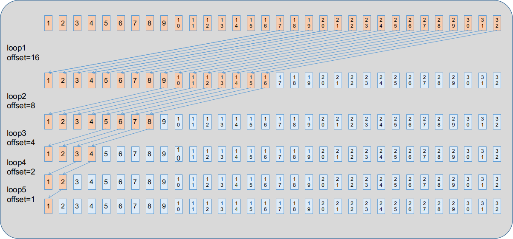

## 1. What is EMD？

- 在统计学中，推土机距离（earth mover's distance ，EMD）用于衡量连个概率分布的距离。在数学中，也叫做Wasserstein距离。EMD距离的出处是2000年发表在IJCV上的“The Earth Mover’s Distance as a Metric for Image Retrieval”一文。最初是用来度量两张图像之间的相似度，也就是用来做图像检索工作的。其可以形象的解释为在一定区域使用两种不同的方式堆积同样数量的土，形成两个土堆，EMD距离指的是将一堆土推到另一种土堆形式的最小成本，其中成本定义为所有被移动的土乘以各自被移动的距离的总和。

- 应用于两个分布的EMD可以阐述如下：

  - 假设有两组Signatures，$P=(p_1,w_{p1}),(p_2,w_{p2}),...,(p_m,w_{pm})$和$Q=(q_1,w_{q1}),(q_2,w_{q2}),...,(q_n,w_{qn})$。$P$中有$m$个类别，$Q$中有$n$个类别。我们可以将两个集合中的$P$看作砂矿，$Q$则是砂石仓库，$w_{pi}$为每一个砂矿包含的砂石数量，$w_{qj}$是每一个仓库能容纳砂石数量。再引入距离矩阵$D$（$m \times n$维），其中$f_{ij}$代表从$p_i$到$q_j$之间的距离，一般为欧氏距离。再定义工作流Flow，记为矩阵$F$（$m \times n $维），其中$f_{ij}$代表从$p_{i}$到$q_j$之间搬运砂石的数量，所以随后的总工作量为：
    $$
    W O R K=(P, Q, \boldsymbol{F})=\sum_{i=1}^{m} \sum_{j=1}^{n} d_{i j} f_{i j}
    $$

  - 对于$f_{ij}$的限制为

    1. $f_{i j} \geq 0$，其中$1 \geq i \geq m$，$1 \geq j \geq n$​，这条约束说明砂石只能从$P$运向$Q$，不能反向。
    2. $\sum_{j=1}^{n} f_{i j} \leq w_{p i}$，其中$1 \leq i \leq m$​，这条约束说明从$p_i$砂矿运出的砂石不能超过该矿蕴含的砂矿总量。
    3. $\sum_{i=1}^{m} f_{i j} \leq w_{q j}$，$1 \leq j \leq n$，这条约束说明运入$q_i$仓库的砂石数量不能超过该仓库的最大容纳量。
    4. $\sum_{i=1}^{m} \sum_{j=1}^{n} f_{i j}=\min \left(\sum_{i=1}^{m} w_{p i}, \sum_{j=1}^{n} w_{q j}\right)$，这条约束说明，整个工作完成时，搬运的总砂石数量要么是所有砂矿的储量总和，要么是所有仓库的容纳量总和。

  - 最终的EMD距离定义就是归一化之后的工作量：
    $$
    \operatorname{EMD}(P, Q)=\frac{\sum_{i=1}^{m} \sum_{j=1}^{n} d_{i j} f_{i j}}{\sum_{i=1}^{m} \sum_{j=1}^{n} f_{i j}}
    $$
    

- 在点云中，EMD通常被应用于衡量两个具有相同数量的点云之间的差异，尤其是在生成类任务中。在生成类任务中，所比较的两个点云往往是目标点云（ground truth）和生成点云。应用于点云的EMD可以定义如下：

  - 假设$P$和$Q$为两个点集，并且两个点集所包含的点的数量相等，数量记为$N$。并且$w_{pi}$和$w_{qi}$始终保持一致，为$\frac{1}{N}$ 。也就是说两个点集中的所有点的地位是平等的，这也符合点云分析中的前提，即点云的置换不变性。由于所有的权重均为$\frac 1 N$，所以：
    $$
    \sum_{i=1}^{N} \sum_{j=1}^{N} f_{i j}=\min \left(\sum_{i=1}^{N} w_{p i}, \sum_{j=1}^{N} w_{q j}\right)=\min \left(N \cdot \frac{1}{N}, N \cdot \frac{1}{N}\right)=1
    $$

    $$
    \sum_{i=1}^{N} \sum_{j=1}^{N} d_{i j} f_{i j}=N \cdot \frac{1}{N} \sum_{i=1}^{N} \sum_{j=1}^{N} d_{i j}=\sum_{i=1}^{N} \sum_{j=1}^{N} d_{i j}
    $$

  - 因此，EMD距离改写为：
    $$
    \operatorname{EMD}(P, Q)=\sum_{i=1}^{N} \sum_{j=1}^{N} d_{i j}
    $$

  - 其实，也就是一般在论文中看到的那样：

  $$
  \operatorname{Loss}_{E M D}(P, Q)=\min _{\phi: P \rightarrow Q} \sum_{x \in P}\|x-\phi(x)\|_{2}
  $$

  - 就是在点集$P$和$Q$中间找到一个双射$\phi$，将两个点集一一对应起来，使得二者计算欧式距离的和最小。这就是一般我们在点云补全等论文中看到的EMD作为损失函数形式的由来了。

## 2. 求解两个点云的EMD距离

> ​		求解点云的EMD距离最终转换为找到一个双射，将两个点云中的所有点建立一一对应关系，在所有的双射中，所有对应点的欧氏距离和最小值就是EMD距离。如果我们首先建立两个点云的距离矩阵$D$，其中矩阵的第$i$行第$j$列表示$p_i$和$q_i$之间的欧式距离，那么我们需要做的是在$D$中找出$n$个不同行不同列的元素，保证它们的总和最小。使用数学符号表示如下。
> ​		给定两个均含有$n$个点的点云$P$和$Q$，求出的距离矩阵为$D_{n \times n}$，其中$D_{ij}$表示$P$中第$i$个点到$Q$中第$j$个点的欧氏距离，确定一个指派矩阵$F_{n \times n}$（$F$中每个元素只能为0或1，分别表示为匹配和不匹配，并且$F$中所有的1不在同行或同列，保证指派结果是一个双射），求
> $$
> F^* = \arg\min_{F}\Sigma_{i=1}^{n}\Sigma_{j=1}^{n}(D_{ij}\times F_{ij})
> $$
> 最终，EMD距离为
> $$
> EMD = \Sigma_{i=1}^{n}\Sigma_{j=1}^{n}(D_{ij}\times F^*_{ij})
> $$
> ​		该问题为运筹学中指派问题，其可以使用两种方法解决：匈牙利算法、拍卖算法。

### 2.1 匈牙利算法。

- 匈牙利算法是运筹学中比较经典的指派问题解决方法，网上有着大量的资料，比如[blog](https://blog.csdn.net/Wonz5130/article/details/80678410)，使用起来比较简单方便。
- 但是匈牙利算法的并行性很差，这一特点在很多论文[[paper1](https://www.georgejpappas.org/papers/CDC08-Assignment.pdf)，[paper2](https://web.mit.edu/dimitrib/www/Auction_Trans.pdf)]中提到，原因是匈牙利算法运行过程中存着这过多的分支，这使得我们更适合在CPU上运行匈牙利，而在并行计算的GPU上很难很有效率地发挥其并行性。
- 这里不对匈牙利算法进行过多的介绍。

### 2.2 拍卖算法

- 拍卖算法在1979年由Dimitri P. Bertsekas提出，其灵感来自于经济活动中的拍卖过程，是一种能够在有限步计算中获得最佳分配的算法。

- 拍卖算法的详细思想和过程可以查阅[blog](https://www.cxyzjd.com/article/Anker_Evans/106539488)，可以概括如下：

  - 有n个人和n件商品，每个人对每个商品都有自己的心里价格，所有商品从0元起拍，记收益=心里价格-商品价格，要求是每个人必须拍卖到一件商品，并且最终所有人对自己拍卖到的商品的物品收益总和最大。

  - 拍卖过程是，每个人根据心里价格和商品目前的价格计算所有商品的收益，收益为心理价格-选择收益最大的商品，报出价格，所报出的价格为：①如果除了要提价的商品以外没有可以提供正收益的物品，则提价为商品收益加$\epsilon$;②如果除了要提价的商品以外还有可以提供正收益的物品，则提价为最大的商品收益减去次大的商品收益，再加上$\epsilon$。

    > 这里可以提价可以是一个范围，在范围内提价越大算法结束越快。

  - 由于报价只能高于商品目前价格，所以拍卖是抢占性的，只要有新的报价，报价人就暂时获得了该物品的拥有权，而该物品之前的拥有人需要重新在所有商品中重新找到收益最大的商品进行报价。只要没有其他人对同一个商品报价更高，则最后一个报价人拍中这件商品。

  - 当每个人都获得商品且没有商品被闲置或者每个人购买所有物品的最大收益都不大于0则算法结束。

- 基于拍卖算法求解两个点云的EMD距离可以描述为：

  - 有两个均包含$n$个点的点云$P$和$Q$，点云$P$中的任何一个点到点云$Q$中任意一个点的距离记为$D_{ij}$，初始化$Q$中第$i$个点的价格$p_i=0$，表示初始价格均为0。
  - 拍卖开始时，$P$中所有点依次对自己最喜欢的点$q_i$报价。这里报价也是抢占性的，被抢占掉的点需要在后续根据最新的价格向量$p$进行重新报价。
  - 为了简化算法，不考虑收益底线，即使收益再小都会继续拍卖。同时报价简化为最喜欢的点的收益和次喜欢的点的收益的差值减去epision。
  - 迭代上述过程直到找到一个双射，或者达到了规定的迭代次数。

- 上述拍卖算法非常适合使用GPU进行并行计算，因为算法涉及到求距离矩阵和最值，这两个都可以通过GPU并行加速。下面通过分析一个大多数人在基于深度学习的各种点云任务中计算两个点云差异时基本都会用的一个使用CUDA编程的并行拍卖算法。

- 基于拍卖算法的点云EMD距离求解方法的正确性证明如下：

  - 正确性：可以参考匈牙利算法的证明，匈牙利法证明了在代价矩阵一行和一列上加上同一个数字，最终结果不变。拍卖算法中每次报价相当于在cost矩阵的一列加上了同一个值（差价），所以结果也是正确的。
  - 收敛性：该算法最终必然收敛吗？还不清楚。

## 3. 求解点云EMD距离的并行拍卖算法

> 整体的求解思路可以分为三个步骤：求解距离矩阵，求解每个点的最优商品和次优商品，报价（修改Pr向量）。
>
> 所解读的核函数支持最多4096个点的EMD距离的求解，下面我们就以4096个点展开讲解。

### 3.1 核函数

- 首先定义核函数的启动函数

  ```c
  void AuctionMatchLauncher(int b,int n,const float * xyz1,const float * xyz2,
                            int * matchl,int * matchr,float * cost){
  	AuctionMatchKernel<<<32,512>>>(b,n,xyz1,xyz2,matchl,matchr,cost);
  }
  ```

  - 这里核函数接受的参数包括：
    - `b`: batch_size，表示有多少对点云。`int`型。
    - `n`: 每个点云有`n`个点。`int`型。
    - `xyz1`: 第一个点云集合，一个包含了`n`个点云的float型的`tensor`，`tensor`的`shape`为 `(b,n,3)` 。
    - `xyz2`: 第二个点云集合，形状、类型和点云集合1一样。`xyz1`中第`k`个点云仅与`xyz2`中第`k`个点云要进行一次拍卖算法。
    - `matchl`: 点云集合1中每个点云的每个点与点云集合2中对应点云的配对信息（点云集合1中的点云拍卖点云集合2中对应的点云）。也是一个`int`型`tensor`，`shape`为 `(b,n)`。
    - `matchr`: 与上一个相反，点云集合1中每个点云的每个点与点云集合2中对应点云的配对信息。形状、类型同上一个。
    - `cost`: 距离矩阵，`shape`为 $(b,n,n)$ 的`float`型的矩阵。
  - 定义grid和block分别呈长度为32和512的线性分布。

### 3.2 并行算法思想描述

- 定义好线程的组织形式以后，我们需要规划每个线程进行什么样的任务，我们既可以让每个线程处理一个点云的运算，也可以让每个线程仅负责一个点的运算，每种策略所拥有的效率并不相同。下面我们首先分析如何合理分配每个线程的任务。

  - 算法的第一步需要求解距离矩阵`cost`。

    - 由于我们希望算法最多能够支持4096个点的点云的EMD距离的计算，最简单的方式是用一个block中的512个线程每次处理`xyz1`中的一个点到`xyz2`中对应点云的4096个点的距离，每个线程需要处理$n/512$个点，总共32个线程，一次可以处理`xyz1`中的32个点，如果把这一个过程看成一次循环，那么需要进行 $(b \times n)/32$次循环，如果`b`和`n`分别等于32和4096，那么就需要4096次循环。
    - 上面的方法的问题在于循环次数太多，由于GPU不具有分支预测能力，也就意味着线程束中有些线程可能会因为等待其他线程而闲置，导致效率不高。一种做法就是展开循环，保证在一次循环中做尽量多的事情，减少分支的引入，最大化多线程算法的效率。这里我们可以使用一个块（512个线程）一次完成512个点到点云2中对应的4096个点的距离计算，相比于上个方法减少了$\frac{4096}{4096/512}=512$倍的分支，每个线程负责一个点到4096个点的距离计算。同时，每个block负责`xyz1`中一个点云中所有点的距离计算，这样做的好处是，一个block中所有线程可以使用共享内存。如果batch size大于block的数量，那么每个block将可能负责多个点云的计算。

  - 算法的第二步是计算`xyz1`中每个点对`xyz2`中对应点云的4096个点的收益的最大值和次大值。根据上面展开循环的思想，我们这里也可以继续展开循环。这里采用的策略是保证块中每个线程能够处理4096个`cost`值的其中8个值的最值，最后将每个线程的最值比较一下就可以得到总的最值。

    - 如果点数是8的整数倍， 那么块中每个线程计算$\frac{4096(最多点数)}{512(block大小)}=8$个值中的最小值。这种方法不涉及循环；

    - 如果点数不是8的倍数但是是4的整数倍，那么每个线程计算4个值的最小值，得到这四个值的最小值和次小值，每个线程计算两次，将两次得到的最小值和次小值对比得到每个线程负责的八个值的最小值和次小值。这个方法涉及两次循环；

    - 如果点数不是8和4的倍数，但是是2的倍数，方法以此类推，涉及4次循环。

    - 如果点数不是8、4、2的倍数，那么就只能每个线程每次处理一个值，每个线程每次循环得到一个新的值，将该值与之前得到的所有值中的最值进行对比，就可以得到这个线程负责的所有值中的最值。

      > 上面四种方法虽然最终结果都是每个线程得到一个最值，但是所经历的循环次数不同，效率也从上往下递减。
      >
      > 至于为什么是8，原因是点云最多有4096个点，那么每个线程最多也就只需要负责8个值的运算，如果点云点数不是8的倍数，那么就根据其是4、2、1的倍数，分多次得到8个值的最（次）小值。

  - 算法的最后一步就是报价，反映在代码上就是修改`cost`矩阵中某一列的所有值，通知其他点对该点的报价。这里采用的是一种更方便的方式，维护一个`price`向量，在向量中记录`xyz2`中每个点的价格，而不用每次都修改`cost`矩阵，相对与全局内存中的`cost`矩阵，`price`向量是块内共享内存，相对访问速度更快。

### 3.3 CUDA代码

>  根据上面的思想，代码入下：

- 首先需要定义一些需要使用的共享内存变量，由于一个块处理一对点云，所以这些变量也仅仅需要支持一对点云的EMD计算：

  ```c
  const int NMax=4096;  // 最多可以处理的点数
  __shared__ short Queue[NMax];
  __shared__ short matchrbuf[NMax];
  __shared__ float pricer[NMax];
  __shared__ float bests[32][3];
  __shared__ int qhead,qlen;
  const int BufLen=2048;
  __shared__ float buf[BufLen];
  ```

  - `Queue`: 用于接下来要报价的点的序号。初始化为1~4096，表示依次报价，每当有点因为报价被挤掉则放到队伍末尾，表示最后再进行一次报价。这个变量表示一个循环链表，链表的头表示当前报价人的序号，链表尾为最后一个需要报价的人的序号。

  - `matchrbuf`: 保存点云1中的当前块处理的点云的配对情况，记录的是配对的点云2中对应点云中点的序号。

  - `pricer`: 当前块负责处理的点云对中属于点云2的那个的价格。

  - `bests`: 对于点云1中的一个点，4096个值中的最值由块内512个线程分组计算，得到的512个最值，为了提高规约效率，这里先将512个最值规约到16个最值，然后再将32个最值规约到1个最值。这里bests就是为了临时存储16个最值的。

  - `qhead,qlen`: 记录循环链表`Queue`的头和链表长度。

  - `buf`: 为了提高并行效率，每个线程需要负责xyz1中一个点到另一个点云中4096个点的距离计算，每个block有512个线程，这里`buf`用于记录每个线程负责点云1中的点的坐标。所以其实`BufLen`只需要$512*3=1536$就够了，可能是为了保证内存的连续性，这里申请了$512*4=2048$的大小。

    > 这里`bests`和`buf`都申请大了，并没有全部用上。

- 接下来的所有计算在一个循环中完成：

  ```c
  for (int bno=blockIdx.x;bno<b;bno+=gridDim.x){
      // step1: 计算第bno组点云对之间的cost矩阵
      // step2: 使用一个while循环按照Queue循环链表的顺序依次进行报价
      // step3: 将第bno组点云的配对结果写入到matchr和matchl中
  }
  ```

  - 这里`bno`表示的是当前线程所在的块需要处理第`bno`组点云对。正如前面所说，如果`batch_size`的数量大于block的数量，那么每个block可能要处理多组点云对。每次for循环会计算$gridDim.x=32$也就是block总数个点云对。如果`batch_size`小于block总数，则最后一些block会闲置，这是用`bno<b`控制的。

  > 由于接下来的所有语句都在该循环中，所以只要确定`bno`号就可以知道在对哪一组点云进行计算，并且每组的计算过程是相同的，所以下面仅针对一组点云进行叙述，记为$P_{bno}$和$Q_{bno}$。

- 在计算`cost`矩阵之前，需要先对声明的共享内存变量初始化，由于这些共享变量仅仅是块内共享的，所以需要在上面的for循环最开始初始化，保证每个block在一开始得到的共享变量是一样的。

  ```c
  for (int bno=blockIdx.x;bno<b;bno+=gridDim.x){
      for (int j=threadIdx.x;j<n;j+=blockDim.x)
          matchl[bno*n+j]=-1;  // matchl矩阵, (b,n), 用-1填充
      for (int j=threadIdx.x;j<n;j+=blockDim.x)
          matchrbuf[j]=-1;  // matchrbuf矩阵, (n=4096,1), 用-1填充
      for (int j=threadIdx.x;j<n;j+=blockDim.x)
          Queue[j]=j;  // Queue矩阵，(n=4096,1)，使用0~4095填充
      for (int j=threadIdx.x;j<n;j+=blockDim.x)
          pricer[j]=0;  // pricer矩阵，(n=4096,1)，使用0填充
      // step1: 计算第bno组点云对之间的cost矩阵
      // step2: 使用一个while循环按照Queue循环链表的顺序依次进行报价
      // step3: 将第bno组点云的配对结果写入到matchr和matchl中
  }
  ```

  - 这里对`matchl`和`matchrbuf`用-1填充，表示$P_{bno}$中每个点都没有配对，如果配对了，那么值不是-1，而是0~4095中的一个数。
  - `Queue`表示$P_{bno}$中的点的报价次序，初始化为顺序向量，表示每个点依次报价。
  - `pricer`初始化为全0，表示$ Q_{bno} $中所有点从0开始起拍。

- 接下来进行第一步，计算cost矩阵：

  ```c
  for (int bno=blockIdx.x;bno<b;bno+=gridDim.x){
      // step0: 初始化共享内存变量
      // step1: 计算第bno组点云对之间的cost矩阵
      const int Block=512;
      for (int k0=0;k0<n;k0+=Block){  
          int k1=min(n,k0+Block);
          for (int k=threadIdx.x;k<(k1-k0)*3;k+=blockDim.x) 
              buf[k]=xyz1[bno*n*3+k0*3+k];
          __syncthreads();  // 保证buf矩阵都被赋值完成了
          for (int j=threadIdx.x;j<n;j+=blockDim.x){  
              float x2=xyz2[bno*n*3+j*3+0];
              float y2=xyz2[bno*n*3+j*3+1];
              float z2=xyz2[bno*n*3+j*3+2];
              for (int k=k0;k<k1;k++){ 
                  float x1=buf[(k-k0)*3+0];
                  float y1=buf[(k-k0)*3+1];
                  float z1=buf[(k-k0)*3+2];
                  float d=sqrtf((x1-x2)*(x1-x2)+(y1-y2)*(y1-y2)+(z1-z2)*(z1-z2));
                  cost[blockIdx.x*n*n+k*n+j]=d;
              }
          }
          __syncthreads(); 
      }
  	// step2: 使用一个while循环按照Queue循环链表的顺序依次进行报价
  	// step3: 将第bno组点云的配对结果写入到matchr和matchl中
  }
  ```

  - 对于点云$P_{bno}$和$Q_{bno}$来说，需要一个$n\times n$的cost矩阵，由第bno个block中所有线程共同计算。根据上面的分析，每个线程负责cost矩阵一行元素的计算，所以每个线程需要处理最少$\frac{n}{512}$行。

  - 所以最外层循环为`for(int k0=0;k0<n;k0+=Block){}`，表示当前循环所有线程应该处理的$P_{bno}$中的512个点的第一个的起始序号。首先，我们需要将本次循环需要计算的$P_{bno}$中的512个点记录下来：

    ```c
    for (int k=threadIdx.x;k<(k1-k0)*3;k+=blockDim.x) 
        buf[k]=xyz1[bno*n*3+k0*3+k];
    __syncthreads();  // 保证buf数组都被赋值完成了
    ```

    - 这里每个线程负责`buf`数组（共享内存）的一个元素的赋值，需要在赋值结束后同步一次，保证block内所有线程都已经完成了赋值操作，此时`buf`数组是完整的。

  - 接下来我们只需要让线程号为`j=threadIdx.x`的线程负责buf数组中256个点到$Q_{bno}$中第`j`个点的距离计算即可：

    ```c
    for (int j=threadIdx.x;j<n;j+=blockDim.x){  
        float x2=xyz2[bno*n*3+j*3+0];
        float y2=xyz2[bno*n*3+j*3+1];
        float z2=xyz2[bno*n*3+j*3+2];
        for (int k=k0;k<k1;k++){ 
            float x1=buf[(k-k0)*3+0];
            float y1=buf[(k-k0)*3+1];
            float z1=buf[(k-k0)*3+2];
            float d=sqrtf((x1-x2)*(x1-x2)+(y1-y2)*(y1-y2)+(z1-z2)*(z1-z2));
            cost[blockIdx.x*n*n+k*n+j]=d;
        }
    }
    __syncthreads(); 
    ```
    
    - 其中`j`用来遍历$Q_{bno}$中的4096个点，用`k`遍历`buf`中的256个点，每个线程负责256个点到第`j`个点的距离计算，并存在cost矩阵的相应位置。
    - 这里`blockIdx.x*n*n+k*n+j`解释为第`blockIdx.x`行（第`blockIdx.x`对点云），`k`列（第一个点云中国第k个点），`j`纵深（第二个点云中第`j`个点）。需要注意的是这里并不是用的第`bno`对点云，而是第`blockIdx.x`对点云，虽然不影响，因为grid中只有32个block，所以实际上每次只能处理32对点云的EMD求解，cost矩阵实际上每次是填不满的，所以存在cost矩阵的哪里是无所谓的，只要后面计算的时候取的值能够对应上就行。但是我认为为了逻辑通顺，这里更应该使用`bno`。
    - 最后再经过一次线程同步，保证$P_{bno}$中的这512个点到$ Q_{bno}$中4096个点的距离已经计算好并保存在`cost`矩阵中`blockIdx.x`位置上。
  
- 对于当前线程来说，当前块负责的点云对产生的距离矩阵已经在上面的计算中完成，接下来就开始拍卖环节。

- 在开始拍卖之前，需要初始化共享内存变量`qhead`和`qlen`，这两个变量在块内共享，所以只需要被其中一个线程初始化一次即可，这里选择第一个线程对其进行初始化：

  ```c
  if (threadIdx.x==0){
      qhead=0;
      qlen=n;
  }
  __syncthreads();  // 等待共享变量初始化完成
  ```

  - 需要注意的是，这里依然要进行一次同步，确保所有线程都能够看到被初始化了的`qhead`和`qlen`。

- 以及几个寄存器变量，仅在单个线程中独享：

  ```c
  int cnt=0;  // 记录拍卖次数
  float tolerance=1e-4;  // 拍卖算法中的epsilon
  int loaded=0; // 是否预加载下一个拍卖人的数据
  float value9,value10,value11,value12,value13,value14,value15,value16; 
  ```

- 接下来开始拍卖，整个拍卖过程写在一个while循环中，while循环的整体思想如下所示：

  ```c
  while(qlen){
      // step1: 确定拍卖人，即根据循环链表Queue确定第一个点云中的一个点
      // step2: 计算拍卖人到所有点的最近点和次近点
      // step3: 开始拍卖，即修改商品的的价格向量price，建立新的映射关系，可能发生挤掉现象
      // step4: 拍卖结束，循环链接长度减一，链表头指向下一个拍卖人，
             // 如果有人被当前拍卖人挤掉，则将挤掉的人加入到链表尾，等待重新拍卖，同时链表长度加一。
  }
  ```

  - 其中while循环的退出条件为所有人都拍卖到了东西，没有再发生挤掉的现象了，表现在代码中就是循环链表长度为0；或者循环次数达到了阈值，则停止拍卖，作为非最优解返回。

  - 确定拍卖人比较简单，可以直接根据循环链表确定：

    ```c
    int i=Queue[qhead];
    int i2;
    if (qhead+1<n) 
        i2=Queue[qhead+1];
    else
        i2=Queue[0];
    float best=1e38f,best2=1e38f;
    int bestj=0;
    ```

    - 其中，`i`为当前拍卖人的序号，`i2`为下一个拍卖人的序号。使用`if...else`是因为是一个循环链表。
    - `best`和`best2`表示当前拍卖人的最优选择和次优选择对应的收益，用于计算报价。
    - `bestj`为当前拍卖人最优选择对应的序号，用于建立映射关系。

  - 正如前面所说，计算最（次）优选择分为两步，首先由每个线程负责八个值的最值计算，然后再根据线程中的最值获得总的最值。并且第一步根据点数是8、4、2、1的倍数分成1、2、4、8次得到每个线程的最值。

  - 首先，如果点数是8的倍数，第一步的代码为：

    ```c
    if (n==blockDim.x*8){ 
        int j=threadIdx.x;
        float value1,value2,value3,value4,value5,value6,value7,value8;
        if (loaded){
            value1=value9+pricer[j];
            value2=value10+pricer[j+blockDim.x];
            value3=value11+pricer[j+blockDim.x*2];
            value4=value12+pricer[j+blockDim.x*3];
            value5=value13+pricer[j+blockDim.x*4];
            value6=value14+pricer[j+blockDim.x*5];
            value7=value15+pricer[j+blockDim.x*6];
            value8=value16+pricer[j+blockDim.x*7];
            loaded=0;
        }else{
            value1=cost[blockIdx.x*n*n+i*n+j]+pricer[j];
            value2=cost[blockIdx.x*n*n+i*n+j+blockDim.x]+
                pricer[j+blockDim.x];
            value3=cost[blockIdx.x*n*n+i*n+j+blockDim.x*2]+
                pricer[j+blockDim.x*2];
            value4=cost[blockIdx.x*n*n+i*n+j+blockDim.x*3]+
                pricer[j+blockDim.x*3];
            value5=cost[blockIdx.x*n*n+i*n+j+blockDim.x*4]+
                pricer[j+blockDim.x*4];
            value6=cost[blockIdx.x*n*n+i*n+j+blockDim.x*5]+
                pricer[j+blockDim.x*5];
            value7=cost[blockIdx.x*n*n+i*n+j+blockDim.x*6]+
                pricer[j+blockDim.x*6];
            value8=cost[blockIdx.x*n*n+i*n+j+blockDim.x*7]+
                pricer[j+blockDim.x*7];
            value9=cost[blockIdx.x*n*n+i2*n+j];
            value10=cost[blockIdx.x*n*n+i2*n+j+blockDim.x];
            value11=cost[blockIdx.x*n*n+i2*n+j+blockDim.x*2];
            value12=cost[blockIdx.x*n*n+i2*n+j+blockDim.x*3];
            value13=cost[blockIdx.x*n*n+i2*n+j+blockDim.x*4];
            value14=cost[blockIdx.x*n*n+i2*n+j+blockDim.x*5];
            value15=cost[blockIdx.x*n*n+i2*n+j+blockDim.x*6];
            value16=cost[blockIdx.x*n*n+i2*n+j+blockDim.x*7];
            loaded=qlen>1;
        }
        int vj,vj2,vj3,vj4;
        if (value1<value2){
            vj=j; 
        }else{
            vj=j+blockDim.x; 
            float t=value1;  
            value1=value2;
            value2=t;
        }
        if (value3<value4){
            vj2=j+blockDim.x*2;
        }else{
            vj2=j+blockDim.x*3;
            float t=value3;
            value3=value4;
            value4=t;
        }
        if (value5<value6){
            vj3=j+blockDim.x*4;
        }else{
            vj3=j+blockDim.x*5;
            float t=value5;
            value5=value6;
            value6=t;
        }
        if (value7<value8){
            vj4=j+blockDim.x*6;
        }else{
            vj4=j+blockDim.x*7;
            float t=value7;
            value7=value8;
            value8=t;
        }
        if (value1<value3){
            value2=fminf(value2,value3); 
        }else{
            value2=fminf(value1,value4); 
            value1=value3;
            vj=vj2;
        }
        if (value5<value7){
            value6=fminf(value6,value7);  
        }else{
            value6=fminf(value5,value8);
            value5=value7;
            vj3=vj4;
        }
    
        if (value1<value5){
            best=value1;
            bestj=vj;
            best2=fminf(value2,value5);
        }else{
            best2=fminf(value1,value6); 
            best=value5;
            bestj=vj3;
        }
    ```

    - 上面的代码比较长，但是可以简单分成两个部分，

    - 第一个部分在`if...else...`中的计算八个点的价值：当前拍卖人的每个线程加载到对应八个点的距离值和价格，得到的value1\~8为这个八个点的收益。同时，根据load的值确定是否预加载下一个拍卖人的数据，预加载的好处是可以节省一次访问显存的过程，节省IO时间。将下一个拍卖人的对这八个点的距离信息保存到`value9~16`，但是并不是收益信息，因为下一个拍卖人的收益信息涉及到当前拍卖人对商品价格的修改，修改的结果保存在共享内存变量price中，这样下一个拍卖人在这个步骤就完全不用再访问显存了。另外，预加载过程应当隔一个人发生一次，所以可以看到在`if`和`else`的最后都分别修改了load的状态。

      > 读取数据的基本单位大于八个点的大小，所以读取八个点和十六个点的时间可以认为是一样的。

    - 接下来通过两两比较直到确定`best`、`best2`和`bestj`。

  - 4的倍数和2的倍数两种情况和上面基本一样，区别仅在于每次处理的点数不同。接下来看一下1的倍数的情况，并比较其和8的倍数的情况的效率：

    ```c
    for (int j=threadIdx.x;j<n;j+=blockDim.x){
        float value=cost[blockIdx.x*n*n+i*n+j]+pricer[j];
        if (best<value){
            best2=fminf(best2,value);
        }else{
            best2=best;
            bestj=j;
            best=value;
        }
    }
    ```

    - 上面的代码是1的倍数的情况，虽然比较简练，但是效率并不高。首先，由于这里是没有预加载的，因为不具有之前的整除性，每个线程负责的点数也是不一样的，所以我们没有办法写出统一的比较大小的算法。所以这里只能是每个线程每次读入一个自己负责的点，计算价值后与之前的最值进行比较。
    - 最终的结果是一样的，即每个线程都有自己的`best`、`best2`和`bestj`，这样的好处是不论执行上面四种方法的哪一种，后续算法的输入都是一样的，代码也就是一样的。

  - 接下来，我们将比较每个线程中的最值，得到一个总的最小值。这个过程分为两步，首先将512个最值规约到16个，然后将16个最值规约成一个最终的最值。但是这里并不像之前比较大小那么简单。之前锁对比的值是一系列`value`，这些`value`都是在线程的寄存器中，可以直接比较。但是现在要比较的512个数分别存放在一个块的512个不同的线程的寄存器中，不可以像之前那样直接访问。

  - 第一步，$512 \to 16$:

    ```c
    for (int i=16;i>0;i>>=1){  // i = 16，8，4，2，1
        float b1=__shfl_down_sync(0xFFFFFFFF,best,i,32);
        float b2=__shfl_down_sync(0xFFFFFFFF,best2,i,32);
        int bj=__shfl_down_sync(0xFFFFFFFF,bestj,i,32);
        if (best<b1){  // best<b1<b2, best<best2, 次小值在b1和best2中
            best2=fminf(b1,best2);
        }else{  // b1<best<best2, b1<b2, 次小值在best和b2中
            best=b1;
            best2=fminf(best,b2);
            bestj=bj;
        }
    }
    ```

    - 最小值都存放在各自线程的寄存器中，并不能直接共享，所以这里要用线程束洗牌指令将同一个block中不同的线程中的数据合并起来。到目前为止，GPU架构中，一个线程束都是32个线程，意思是线程束调度器会调度32个线程进行运算，线程束洗牌指令可以使得线程束内的线程可以获得线程束内其他线程的寄存器值。这里使用的`__shfl_down_sync`函数是线程束洗牌指令中的其中一个，关于线程束洗牌指令更多内容可以查看Reference[3]和[4]。

    - `__shfl_down_sync(MASK, val, offset)`的含义为：记当前线程在线程束中的位置为`X`，那么函数返回线程束中第`X+offset`个线程中的`val`变量的值。这种在寄存器之间传值的执行速度要远比访问共享内存要快。另外，线程束洗牌指令要求线程束中的线程是同步的，如果不同步，会先将它们同步。`MASK`为32个二进制掩码， 被`MASK`指定的线程返回向后偏移为 `offset` 的线程中的变量`val`的值，其余线程返回0 。这里我们简单指定所有线程都向前传送。

      > 注意，在CUDA9.0之前，使用的是不带`_sync`的版本，二者有差别。
    
    - 为了更清楚地展示线程束洗牌的过程，我做了如下示意图展示了如何通过线程束洗牌，可以看到经过五次循环之后，线程束内的所有线程中的最值都规约到了第一个线程中去。需要注意的是，这里设置的线程束洗牌指令的掩码是`0xFFFFFFFF`，也就是说每次loop所有线程都会向前传递，但是图中的其他值传递对最终结果没有影响，所以没有画出来。
    
      
    
  - 第二步：$16 \to 1$:

    - 经过上面的线程束洗牌指令，512个最值都规约到了线程束的第一个线程中去了，这些线程的index均是32的整数倍，总共16个。下面将这16个线程的结果规约到一个最终的最值。

    - 首先，将这16个线程中的最值保存在bests矩阵中，这些最值从寄存器中转移到共享内存中去。

      ```c
      if ((threadIdx.x&31)==0){  // 0，32，64，……，480
          bests[threadIdx.x>>5][0]=best;
          bests[threadIdx.x>>5][1]=best2;
          *(int*)&bests[threadIdx.x>>5][2]=bestj;
      }
      __syncthreads();
      ```

    - 然后我们用前16个线程分别持有16个最值中的一个，使用线程束洗牌指令将结果保存在第一个线程中

      ```c
      int nn=blockDim.x>>5;  // 512>>5=16
      if (threadIdx.x<nn){
          best=bests[threadIdx.x][0];
          best2=bests[threadIdx.x][1];
          bestj=*(int*)&bests[threadIdx.x][2];
          for (int i=nn>>1;i>0;i>>=1){  // i = 8,4,2,1
              float b1=__shfl_down_sync(0xFFFFFFFF,best,i,32);
              float b2=__shfl_down_sync(0xFFFFFFFF,best2,i,32);
              int bj=__shfl_down_sync(0xFFFFFFFF,bestj,i,32);
              if (best<b1){
                  best2=fminf(b1,best2);
              }else{
                  best=b1;
                  best2=fminf(best,b2);
                  bestj=bj;
              }
          }
      }
      ```

      - 其中`nn`表示我们之前将512个最值规约到了多少个。

        > 这里我一开始比较疑惑的是，每个线程本来都有着自己的最值的，这里3~5行对它们的最值重新赋值，但是赋值后并没有进行同步，为什么这里不用保证每个线程都已经完成了最值的重新赋值再进行线程束洗牌？后来才想起来，线程束洗牌指令在执行之前会强制让线程束内的线程同步，同时这里所用到的16个线程是在同一个线程束中，所以不用显示同步了。

      - 最终的最值结果保存在整个block中第一个线程的`best`、`best2`、`bestj`。

  - 经过上面所有过程之后，对于当前block所负责的点云$ P_{bno}$中第Queue[qhead]个点到点云$ Q_{bno}$中所有点的`best`、`best2`、`bestj`已经计算完成，下面开始执行该点的拍卖过程：

    ```c
    if (threadIdx.x==0){
        float delta=best2-best+tolerance; // 计算epsilon
        pricer[bestj]+=delta;  // 拍卖人对自己的最爱拍出新价格
        qhead++; // 循环链表指针后移，指向下一个拍卖人
        if (qhead>=n)
            qhead-=n;
        qlen--; // 链表长度减一，表示建立了一个映射
        int old=matchrbuf[bestj];  // 当前拍卖人的最爱有没有被其他人占领
        cnt++;  // 拍卖次数增加一次
        if (old!=-1){  // 如果当前拍卖人的最爱被其他人占领了
            int tail=qhead+qlen;  // 计算循环链表尾部在哪
            if (tail>=n)
                tail-=n;
            Queue[tail]=old;  // 将被挤掉的人挂在链表尾
            qlen=qlen+1;  // 链表长度加一
    
        }
    	// 下面是判断是否达到了终止条件   
        if (cnt==(40*n)){
            if (tolerance==1.0)
                qlen=0;
            tolerance=fminf(1.0,tolerance*100);
            cnt=0;
        }
    }
    ```

    - 最终的拍卖过程只需要一个块中的一个线程即可，不涉及到并行计算，这里选用第一个线程进行计算。
    - 判断是否到达终止条件的逻辑是：先判断`tolerance`是否达到`1.0`了，如果到了，那么`qlen`强制归零，终止`while`循环；如果没有，`tolerance`取`1.0`和其`100`倍的最小值，加快收敛速度，并且将`cnt`置0，重新拍卖`40*n`次。
    - 另一个隐式的结束条件是循环链表的长度，如果循环链表长度归零，则没有人要继续拍卖，`while`循环结束。

  - 最后，将本轮拍卖结果写入到`matchrbuf`中：

    ```c
    __syncthreads();
    if (threadIdx.x==0){  // 赋值操作仅需要一个线程来完成就行，避免多个线程同时写一块内存
        matchrbuf[bestj]=i;  // 第二个点云中bestj个点与第一个点云中第i个点配对
    }
    __syncthreads();  // matchrbuf是__shared__，需要在这里同步块内线程
    ```

  - 通过上面的拍卖过程，$P_{bno}$中每个点都拍卖到了$Q_{bno}$中的一个点，将映射结果存储在`matchr`和`matchl`中即可建立$P_{bno}$与$Q_{bno}$的一个双射：

    ```c
    for (int j=threadIdx.x;j<n;j+=blockDim.x)
        matchr[bno*n+j]=matchrbuf[j];
    for (int j=threadIdx.x;j<n;j+=blockDim.x)
        matchl[bno*n+matchrbuf[j]]=j;
    __syncthreads();  // 保证双射建立完成
    ```

- 整个并行计算的过程可以形象的描述如下：

  > 对于两组点云，每组分别有`b`个点云，每个点云有`n`个点，我们的任务是计算每对点云之间的EMD距离。
  >
  > 我们首先分配32个block，每个block中有512个线程，以一个block为一个工作小组，每个工作小组负责一对点云的EMD计算。
  >
  > 对于一个工作小组（block）来说，它们拿到两个点云以后，第一件事是计算点云之间的距离矩阵，由于一个工作小组里面有512个线程，自然的，每个线程负责第一个点云的一个点到第二个点云中的n个点的距离计算，然后填充到距离矩阵对应的位置上。由于第一个点云中点的个数可能会大于512，所以每个线程可能会需要负责多个点的计算。
  >
  > 工作小组内所有线程将负责的两个点云的距离矩阵完全计算完成以后，就可以开始拍卖了。
  >
  > 首先，我们记录所有需要拍卖的人，也就是第一个点云中的点，每个点依次拍卖。
  >
  > 对于当前的拍卖人，其首先需要比较它对所有点的喜爱程度，找到第一喜欢和第二喜欢的那个点。也就是找n个点的最值。
  >
  > 这时候，工作小组中的所有线程负责其中一些值的大小比较，保证最后每个线程都记住自己处理的那些值的最值。
  >
  > 然后我们比较每个线程中的最值，得到总的`n`个点的最值。
  >
  > 然后由工作小组中的第一个线程负责根据当前点对最喜欢的那个点的拍卖，包括修改价格、声明自己不需要再拍卖了，通知下一个拍卖人，以及如果它挤掉了其他拍卖人，还要通知其他拍卖人到最后排队，等待之后重新拍卖。

## Reference

[1] [Wikipedia contributors. "Earth mover's distance." *Wikipedia, The Free Encyclopedia*. Wikipedia, The Free Encyclopedia, 6 Sep. 2021. Web. 10 Nov. 2021.](https://en.wikipedia.org/wiki/Earth_mover%27s_distance)

[2] [点云分析中的EMD（Earth Mover’s Distance）距离](https://blog.csdn.net/Gregory24/article/details/104495727)

[3] [Using CUDA Warp-Level Primitives](https://developer.nvidia.com/blog/using-cuda-warp-level-primitives/)

[4] [【CUDA 基础】5.6 线程束洗牌指令](https://face2ai.com/CUDA-F-5-6-%E7%BA%BF%E7%A8%8B%E6%9D%9F%E6%B4%97%E7%89%8C%E6%8C%87%E4%BB%A4/)

[5] [Cheng, John, Max Grossman, and Ty McKercher. *Professional CUDA c programming*. John Wiley & Sons, 2014.](https://books.google.com.hk/books?hl=en&lr=&id=q3DvBQAAQBAJ&oi=fnd&pg=PR17&dq=Professional+CUDA+C+Programming&ots=Kio2_nzxI1&sig=wo3a06_kK3QepKxMsVHIG4qk3Hk&redir_esc=y&hl=zh-CN&sourceid=cndr#v=onepage&q=Professional%20CUDA%20C%20Programming&f=false)

[6] [人工智能编程|谭升的博客](https://face2ai.com/program-blog/#GPU%E7%BC%96%E7%A8%8B%EF%BC%88CUDA%EF%BC%89)

[7] [NVIDIA CUDA C++ Programming Guide](https://docs.nvidia.com/cuda/cuda-c-programming-guide/index.html)https://github.com/godweiyang/NN-CUDA-Example)