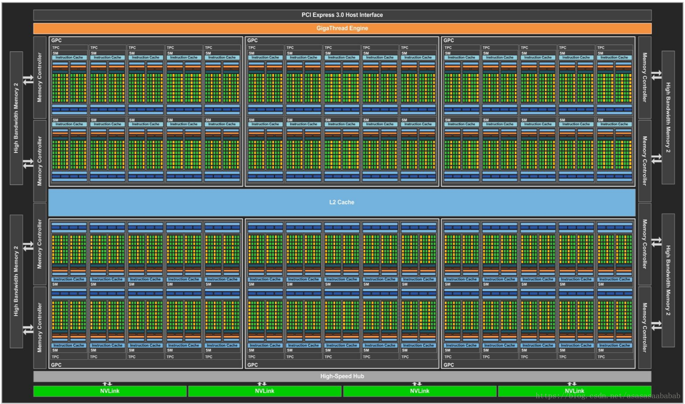
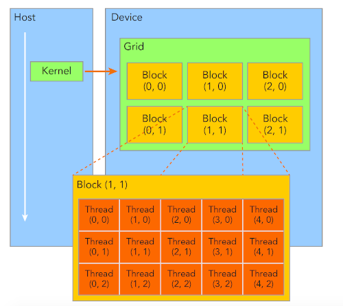
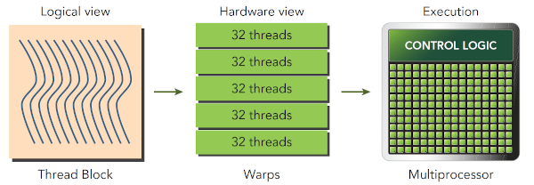
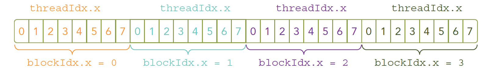
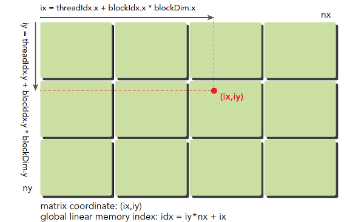
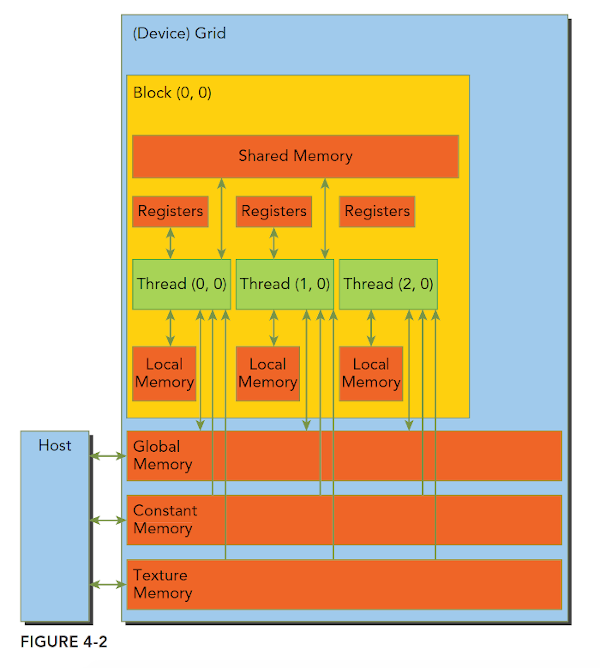

## 1. CUDA执行模型



<center>图1.1 英伟达PASCAL架构的GP100 GPU架构</center>

- 一个常见的GPU架构如上图所示，整个GPU、由一系列的SM组成 ，每个SM中包含很多的CUDA Core（绿色点），CUDA core也叫Streaming Processor（SP）。

## 1.1 SM 

- SM, Streaming Multiprocessor, 流多处理器。

- GPU中每个SM都能支持数百个线程并发执行，每个GPU通常有多个SM，当一个核函数的网格被启动的时候，多个block会被同时分配给可用的SM上执行。
- 当一个blcok被分配给一个SM后，他就只能在这个SM上执行了，不可能重新分配到其他SM上了，多个线程块可以被分配到同一个SM上。
- 在SM上同一个块内的多个线程进行线程级别并行，而同一线程内，指令利用指令级并行将单个线程处理成流水线。

## 1.2 warp (线程束)

- CUDA 采用单指令多线程SIMT架构管理执行线程，不同设备有不同的线程束大小，但是到目前为止基本所有设备都是维持在32，也就是说每个SM可以负责多个block的执行，一个block有多个线程（可以是几百个，但不会超过某个最大值），但是从机器的角度，在某时刻T，SM上只执行一个线程束，也就是32个线程在同时同步执行，线程束中的每个线程执行同一条指令，并保持相同的进度，当指令中出现分支时，线程束中不执行的线程需要等待其他线程束执行完成而不能执行其他任务。
- 延迟隐藏：线程束执行速度相对于内存IO来说非常快，这也就意味着线程执行到某个过程可能需要等待数据的传输。为了提高利用效率，同一个SM上可以有不止一个常驻的线程束，如果线程束需要等待，SM会切换到其他常驻线程束，营造了这些常驻线程束在并行执行的假象。
- 更高级的GPU为每个SM提供了两个线程束管理器。

> 形象化的理解：在声明核函数时，我们会声明需要的线程数量（grid和block的形状）。首先我们会在主机端定义并启动核函数，通过PCIe总线与GPU通讯，之后我们的核函数开始在GPU上执行，每个线程都会按照核函数的指示开始运算，但是由于运算资源（硬件）有限，不可能每个线程都能开始执行。首先，每个block中的线程会交给一个SM负责，每个SM根据自己的线程束管理器数量以线程束为单位调度需要执行的线程，当正在执行的线程束因为资源等待或者其他原因停止的时候，SM会切换到其他自己管理的需要被执行的线程上去，同样以线程束为单位进行调度，直到将所有线程任务执行完。

## 2. 线程层次

## 2.1 Grid and Block



<center>图2.1 二维grid和二维block</center>

- 在计算机中，内存总是一维线性存在的，线程的访问方式实际上也是一维的，但是为了方便更方便地进行编程，CUDA对硬件进行了抽象，grid和block是为了方便进行线程管理而抽象出来的线程组织模式。如上图所示，每个核函数能够调度的所有线程在一个核函数唯一对应的grid中，一个grid中包含了多个Block，每个Block包含了相同数量的线程。

  - grid

    - 一个网格有效地代表了一个内核启动，即它包含了要为一个特定内核启动运行的所有块(以及线程)。关于块和网格的尺寸存在某些限制，这些限制主要是特定于体系结构的(通常，对于同一代的所有GPU模型，它们在很大程度上是相同的)。
    - 为了提高并行效率，需要考虑网格中的block大小和数量。但是随着CUDA版本的优化，如何适应着CUDA进行优化我还未了解到，在开发过程中，这是一个优先级比较靠后考虑的事情。

  - block

    - 每个block内的线程拥有一个块内的共享内存

    - CUDA的设备在执行过程中会以block为单位，每个block会由一个专门的SM进行运算。由于线程束是SM的基本执行单元，当前一个线程数都是32个线程，所以block被分配给SM后还会根据线程束（warp）的大小将一个block分成多次执行，block内的线程按照单指令多线程SIMT的方式“并行”执行，每一步执行相同的指令，但是处理的数据为私有的数据。一个block的线程调度如下所示。

      

    - 线程块之间是彼此独立的，表现在：

      - 不同的块可以以任意顺序（串行或并行）执行。
      - 一个grid中的所有block可以被任意数量的处理器以任意顺序调度。这就使得处理器的数量具有可扩展性，对于同一段程序，每个SM负责调度一个块，那么八个块可以由四个SM分两次调度，或者由两个SM分四次调度。
      - 不同block内的线程不可以相互影响，因为它们是物理隔离的。

    - thread

      - 线程是CUDA 架构下GPU芯片执行时的最小单位。
      - 一个block中的thread能存取同一块共享内存，可以快速进行同步和通信操作。


## 2.2 线程的索引方式

- 为了便于定位thread和block，需要对thread和block建立索引作为它们的唯一标识。首先需要介绍几个CUDA中内置的结构体，使用它们对线程进行索引

  - `gridDim`：grid的维度大小

    - 根据grid的形状，结构体`gridDim`可以包含三个整数变量:`gridDim.x`、`gridDim.y`、`gridDim.z`，分别表示grid在`x`、`y`、`z`三个方向上的可以容纳block的数量。

  - `blockDim`：block的维度大小

    - 根据block的形状，结构体`blockDim`可以包含三个整数变量:`blockDim.x`、`blockDim.y`、`blockDim.z`，分别表示block在`x`、`y`、`z`三个方向上的可以容纳thread的数量。

  - `blockIdx`：block在grid内的位置索引	

    - 根据grid的形状，`blockIdx`可以包含三个整数变量：`blockIdx.x`、`blockIdx.y`、`blockIdx.z`，分别表示block处于grid中`x`、`y`、`z`三个方向上的位置。

  - `threadIdx`：thread在所在block中的为欧洲索引

    - 根据block的形状，`threadIdx`可以包含三个整数变量：`threadIdx.x`、`threadIdx.y`、`threadIdx.z`，分别表示thread处于block中`x`、`y`、`z`三个方向上的位置。

      > 注意：`gridDim.x`指的是grid形状的第一维的长度，如果是二维grid，则表示grid一行包含`gridDim.x`个块，也就是grid的列长。

- 一维grid和一维block

  - 这是最简单的线程组织形式。

  - 在这种情况下，任意一个thread在block中的编号为`threadIdx.x`，每个block包含`blockDim.x`个thread。

  - 在这种情况下，任意一个block在grid中的编号为`blockIdx.x`，每个grid包含`gridDim.x`个block。

  - 那么，任意一个线程在grid中的编号应该是`blockIdx.x * gridDim.x + threadIdx.x`。

  - 下图为一个`gridDim.x = 4`、`blockDim.x = 8`的线程布局

    

- 二维grid和二维block

  - 这种方式的线程布局如下图所示所示。

    

  - 在这种情况下，任意一个thread处在block中的`threadIdx.x`行、`threadIdx.y`列的位置，每个block又处在grid中第`blockIdx.x`行和`blockIdx.y`列的位置。

  - 那么，任意一个thread在block中的编号为`threadIdx.y * blockDim.x + blockDim.x`。

  - 同理，任意一个block在grid中的编号为`blockIdx.y * gridDim.x + gridDim.x`。

  - 任意一个thread在grid中处在`blockIdx.x * gridDim.x + threadIdx.x`行、`blockIdx.y * gridDim.y + threadIdx.y`列的位置。

  - 任意一个thread在grid中标号为`(blockIdx.x + blockIdx.y * gridDim.x) * (blockDim.x * blockDim.y)  + (threadIdx.y * blockDim.x) + threadIdx.x`

    > 解释如下：对于一个线程，其所在的block的编号为`(blockIdx.x + blockIdx.y * gridDim.x)`，所以其前面编号那么多个块，每个块包含`(blockDim.x * blockDim.y)`个线程，所以前面的所有块包含`(blockIdx.x + blockIdx.y * gridDim.x) * (blockDim.x * blockDim.y)`个线程，再加上该线程在当前块中的编号`(threadIdx.y * blockDim.x) + threadIdx.x`即可得到该线程在整个grid中的编号。

- 三维grid和三维block

  - 在这种情况下，任意一个block在grid中的编号为`blockIdx.x + blockIdx.y * gridDim.x + gridDim.x * gridDim.y * blockIdx.z`。
  - 任意一个thread在grid中的编号为`(blockIdx.x + blockIdx.y * gridDim.x + gridDim.x * gridDim.y * blockIdx.z) * (blockDim.x * blockDim.y * blockDim.z) + (threadIdx.z * (blockDim.x * blockDim.y)) + (threadIdx.y * blockDim.x) + threadIdx.x`。

- 其他的划分方式的索引可以以此类推。

## 3. CUDA内存模型



- CUDA编程涉及到的内存结构如上图所示。
  - Host: CPU Memory
    - 通过PCIe Bus在CPU和GPU之间传输数据。使用的函数包括cudaMalloc（内存分配）、cudaMemcpy（内存拷贝）、cudaMemset（内存设置）、cudaFree（内存释放）。
  - Global Memory: 全局内存。
    - 在Host端或Device端使用`__device__`声明。
    - 一个Grid内的所有线程可以访问。
  - Shared Memory: 共享内存
    - **在核函数中**使用`__shared__`可以声明共享内存变量。
    - 如图所示，共享内存的变量可以被一个Block内所有线程共享，共享内存的生命周期和Block一致。
    - 注意事项：
      1) 不要过度使用共享内存，否则会导致更多的线程块无法被SM启动，影响活跃的线程块数量。
      2) 共享内存可以被Block中的线程共用，为了避免竞态条件 (Race Condition)，可以使用`__syncthreads()`命令确保Block中的每个线程都已经执行完了在该命令之前的语句，通常用来保证Block中所有线程对于同一个`__shared__`变量的读写全部完成，然后继续后面的程序逻辑。
  - Registers: 寄存器
    - **在核函数中**不用修饰符声明的变量就是一个寄存器变量。
    - 如图所示，每个线程都有自己专属的寄存器，是GPU中速度最快的内存空间，每个线程的寄存器变量仅对自己可见，声明周期和核函数一致。
    - 一个block中的线程对各自的寄存器不可见，但是可以通过线程束洗牌指令获得同一个block的其他线程的寄存器变量。
    - 由于及寄存器大小有限，寄存器变量并不总是在寄存器上，而是仅仅在被线程使用时调度到寄存器上，否则存储在本地内存中。
  - Local Memory: 本地内存
    - 核函数中符合存储在寄存器中但不能进入被核函数分配的寄存器空间中的变量将存储在本地内存中，编译器可能存放在本地内存中的变量有以下几种：
      - 使用未知索引引用的本地数组
      - 可能会占用大量寄存器空间的较大本地数组或者结构体
    - 注意事项：
      - 本地内存实质上是和全局内存一样在同一块存储区域当中的，高延迟、低带宽。对于2.0以上的设备，本地内存存储在每个SM的一级缓存，或者设备的二级缓存上。

  - Constant memory: 常量内存

    - **在Host端**使用`__constant__`声明，不可以在核函数内声明。
    - 常量内存可以在Host端初始化，在核函数中读但是不可以修改。
    - 常量内存驻留在device的内存中，每个SM都有专用的常量内存缓存。

    - 注意事项：
      - 每从一个常量内存中读取一次数据，都会广播给线程束里的所有线程。所以常量内存适合用来存储所有线程都会用到的变量，比如多项式计算问题中的系数。

  - Texture Memory: 纹理内存

    - TODO

## 4. 核函数

- 核函数在主机端声明、调用，在GPU上执行。

- 声明一个核函数的方式是使用`__global__`限定符

  ```c
  __global__ void kernel_name(argument list);
  ```

- 编写核函数需要注意以下几点：

  - 只能访问设备内存
  - 必须有void返回类型
  - 不支持可变数量的参数
  - 不支持静态变量
  - 显示的异步行为

- 以简单的矩阵运算说明整个核函数的编写方式，使用2范数求两个矩阵之间的距离

  - **定义核函数和启动函数**：`two_norm_kernel.cu`

    ```c
    #include <cstdio>  //  用于print结果
    
    __global__ void two_norm_kernel(const float *a,const float *b,float *c, int n, int m) {
        __shared__ float a_minus_b[64*64];  // 不支持可变数量的参数,矩阵维度最多为(4096,4096)
    
        // 异常、越界处理
        if(threadIdx.x==0)
            printf("after compute a-b:\n");
        for(int row=threadIdx.x;row<n;row+=blockDim.x){
            for(int col=0;col<m;col++){  // 循环展开
                float a_ij = a[row * m + col];
                float b_ij = b[row * m + col];
                a_minus_b[row * m + col] = (a_ij - b_ij) * (a_ij - b_ij);
                printf("tensor a-b,coord=(%d,%d), value=%f\n", row,col, a_minus_b[row * m + col]) ;
            }
        }
    
        __syncthreads();  // 等待整个a_minus_b被计算完毕
    
        // 将每行结果加到每行的第一个元素上
        if(threadIdx.x==0)
            printf("after add rows to first col\n");
        for(int row=threadIdx.x;row<n;row+=blockDim.x){
            for(int col=1;col<m;col++){  // 循环展开
                a_minus_b[row * m + 0] += a_minus_b[row * m + col];
            }
            printf("tensor a-b,row=%d, value=%f\n", row, a_minus_b[row * m + 0]);
        }
    
        __syncthreads();  // 等待结果都加到了第一行
    
        // 将所有结果加到第一行第一列元素上
    	if(threadIdx.x == 0){
            for(int i=1;i<n;i++)
                a_minus_b[0] += a_minus_b[i * m + 0];
            c[0] = sqrtf(a_minus_b[0]);
        }
    }
    
    void launch_two_norm(const float *a,const float *b,float *c, int n, int m) {
        two_norm_kernel<<<1, 512>>>(a, b, c, n, m);
    }
    ```

    - **启动函数：**：
      
      - 启动函数`launch_two_norm`的作用是定义用于核函数运行的`grid`和`block`信息。

      - `<<<grid,block>>>`内的分别指定grid的形状和block的维度，
      
        - 如果申请的是一维grid或block，直接使用整数表示就可以，比如`<<<8,256>>>`表示一个grid里有8个block，按一维分布，一个block中有256个thread，同样按照一grid和block可以通过CUDA C内置的数据类型dim3类型的变量来配置维分布。
      
        - 如果申请的是二维或者三维，grid和block可以通过CUDA C内置的数据类型dim3类型的变量来配置。比如下面的例子表示的grid和block的维度分别为$4\times 4$和$16\times16$。
      
          ```c
          dim3 grid(4,4);
          dim3 block(16,16);
          kernel_name<<<grid, block>>>(argument list);
          ```
      
    - **核函数**：
      
      - 核函数就是在CUDA模型上诸多线程中运行的那段串行代码，这段代码在设备上运行，用NVCC编译，产生的机器码是GPU的机器码.

      - 为了使用一些必要的c函数，首先导入`cstdio`库，这里我们是为了后面调用`printf`函数。
      
        > 在cuda计算能力2.0以上才支持printf。
      
      - 核函数`two_norm_kernel`需要五个参数，
      
        - `a`和`b`为两个大小相同的矩阵，规定这两个矩阵已经在显存中，直接传递引用即可，节省内存开销。
        - `c`为一个$1 \times 1$的矩阵，存储最后的结果，由于核函数无返回值，所以通过指针参数传递函数结果。
        - `n`和`m`为矩阵`a`和`c`的行数和列数，两个int值，直接值传递就行。
      
      - 这里我使用一维block和一维grid的原因是我希望每个矩阵一行的计算由同一个线程进行处理，所有线程将计算结果写入到同一个块内共享内存上，实际上这个例子中我们也不需要多个block，因为block之间是物理隔离的，所以如果用多个快block完成计算还要考虑最后将不同block的计算结果总结到一个块上，使得编程更加复杂，所以这里grid中只包含了一个block。
      
      - 这里我将`norm`的计算分成三个步骤：首先计算$a\_minus\_b_{n \times m}= (a_{n \times m}-b_{n \times m})^2$，然后将$a\_minus\_b_{n \times m}$中的每一行的所有数加到每一行的第一列上，最后再将第一列上的所有结果加到第一行第一列上，取根号即可得到结果。
      
        - 第一步：计算$a\_minus\_b_{n \times m}= (a_{n \times m}-b_{n \times m})^2$
      
          - 声明$a\_minus\_b$为共享变量，对于矩阵`a`和`b`的`(i,j)`位置的计算结果存放在该共享变量的`(i,j)`位置。
      
          - 共享变量$a\_minus\_b$的大小声明为`[64*64]`，表示矩阵中的元素个数不可以超过4096个，否则将无法将完整的计算结果记录。需要注意的是，核函数内不支持可变数量的参数，所以并不可以按照`n`和`m`的大小进行动态分配共享变量的大小。
      
          - 由于一开始设计的是矩阵的一行由一个线程处理，考虑到线程数可能会比矩阵行数多，有些线程可能会需要处理多行。这里采用的策略是将矩阵行按照总线程数分组，每组具有总线程数行，第`i`个线程处理每组中第`i`行。使用for循环表示如下：
      
            ```c
            for(int row=threadIdx.x;row<n;row+=blockDim.x){
                // 对于线程threadIdx.x，假如它第k次进入循环，
                // 则其需要处理的矩阵的第row = threadIdx.x + k * blockDim.x行的计算
            }
            ```
      
          - 对于进入循环的线程，其需要进行矩阵的第`row`行所有列的矩阵减法。循环体中的代码比较简单，直接找到`row`行`col`列的元素在矩阵中的序号，取出对应的值进行运算即可。
      
            ```c
            for(int row=threadIdx.x;row<n;row+=blockDim.x){
                for(int col=0;col<m;col++){  // 循环展开
            		float a_ij = a[row * m + col];
                    float b_ij = b[row * m + col];
                    a_minus_b[row * m + col] = (a_ij - b_ij) * (a_ij - b_ij);
                    printf("tensor a-b,coord=(%d,%d), value=%f\n", \
                           row,col, a_minus_b[row * m + col]) ;
            	}
            }
            ```
      
          - 由于块内线程对共享内存进行了修改，在完成$a\_minus\_b_{n \times m}= (a_{n \times m}-b_{n \times m})^2$的计算以后，需要进行一次块内线程同步，保证块内所有线程都已经到达同步点后再开始继续执行下面的语句，也就保证了此时$a\_minus\_b_{n \times m}$中所有元素都已经被计算好了。在CUDA中使用下面语句进行块内同步：
      
            ```c
            __syncthreads();
            ```
      
        - 第二步：将每一行的所有数加到每一行的第一列上
      
          - 这个步骤的访问顺序和上面的一样，都是每个线程对行内所有元素依次访问，所以只需要修改循环体就可以：
      
            ```c
            for(int row=threadIdx.x;row<n;row+=blockDim.x){
                for(int col=1;col<m;col++){  // 循环展开
                    a_minus_b[row * m + 0] += a_minus_b[row * m + col];
                }
                printf("tensor a-b,row=%d, value=%f\n", row, a_minus_b[row * m + 0]);
            }
            __syncthreads();  // 等待结果都加到了第一行
            ```
      
        - 第三步：将第一列的加和结果加到第一行第一列的的位置
      
          - 需要注意的是，由于数据已经减少到一列，不需要再使用所有线程了，只需要使用一个线程就可以完成这个累加结果。（当然也可以使用规约的方法更快地得到结果，但是我们这里不继续深入了）
      
            ```c
            if(threadIdx.x == 0){
                for(int i=1;i<n;i++)
                    a_minus_b[0] += a_minus_b[i * m + 0];
                c[0] = sqrtf(a_minus_b[0]);
            }
            ```
      
          - 这里我们选择使用第一个线程进行最后的加和，上述`if`语句如果缺失，则所有线程都会对第一列进行一次加总，导致最终结果扩大了线程数（512）倍。
      
          - 最后使用CUDA函数`sqrtf`既可对累加结果求平方根，得到最后结果。

## 5. PyTorch + 自定义cuda核函数

> 定义好的CUDA函数可以使用nvcc编译运行，这是比较常见的使用方法。这里我们使用PyTorch将核函数打包成库，可以更方便地使用python进行调用。这里介绍两种方式：构建共享库和及时编译。

### 5.1 方法一：构建共享库

  > 通过构建共享库，任何python代码都可以随时使用自定义的cuda函数。不需要在目录中再携带核函数。但是缺点是每一次修改核函数都需要重新构建共享库。

- 构建共享库的流程可以概括为：

  - 1. 编写核函数
  - 2. 编写头文件
  - 3. 构建cpp文件并在其中使用**PYBIND11**将核函数绑定到python
  - 4. 使用**setuptools**编译打包C++工程为so文件

- 1. 编写核函数在前面已经完成，结果就是一个`two_norm_kernel.cu`文件。

- 2. 编写头文件

     - 在这种方式下必须要有一个定义了kernel启动函数的头文件，否则会编译失败。头文件直接写kernel启动函数的声明即可：（文件名：`two_norm_kernel.h`）

       ```c
       void launch_two_norm(const float *a,const float *b,float *c, int n, int m);
       ```

- 3. 构建`.cpp`文件并在其中使用**PYBIND11**将核函数绑定到python

     - `.cpp`文件的固定格式如下：（文件名：`two_norm_bind.cpp`）

       ```cpp
       #include <torch/extension.h>
       #include "two_norm_kernel.h"
       void torch_launch_two_norm(const torch::Tensor &a_tensor,
                                  const torch::Tensor &b_tensor, 
                                  torch::Tensor &c_tensor, 
                                  int n, int m) {
           launch_two_norm((const float *)a_tensor.data_ptr(),
                           (const float *)b_tensor.data_ptr(),
                           (float *)c_tensor.data_ptr(),
                           n,m);
       }
       PYBIND11_MODULE(TORCH_EXTENSION_NAME, m) {
           m.def("two_norm",  // 函数在python中调用的名字
                 &torch_launch_two_norm,  // 函数指针，需绑定的C++函数引用
                 "compute 2-norm of two matrix"  // 函数说明
                 );
       }
       ```

     - 第一行代码是导入C++的头文件，这些头文件的作用是提供torch的C++的一些重要API，包括PyTorch中用C++编写的Tensor类和对应的方法，以及一些激活函数和常见的张量操作。
     - 第二行代码导入的是刚才定义的头文件，其中包含了核函数的启动函数，启动函数在第七行被调用。
     - 接下来定义一个C++函数，这个函数用于接受Tensor并将Tensor转换成核函数可以接受的参数，并调用核函数的启动函数。
     - 最后，为了能够把函数导出为python可以使用的包的形式，需要使用`PYBIND11_MODULE`宏来定义一个模块。这个宏包含两个参数，其中宏`TORCH_EXTENSION_NAME`表示的是最终生成的python扩展模块的名字，`m`表示的是这个模块本身，`m`可以为随意定义。
       - 在宏的主体中，使用了def函数来注册类中具体的函数，这里仅注册了一个函数，可以注册多个，每个注册的函数都是最终生成的python包中的一个函数。
       - 函数`m.def`中有三个参数，分别用于定义该函数在生成的python模块中的函数名，需要绑定的C++函数引用，这里绑定的就是上面定义的C++函数，最后一个参数为函数定义了简单的说明，共享库构建完成后可以使用`help`函数查看到函数的说明。

- 4. 使用**setuptools**编译打包C++工程为`.so`文件

  - 定义好需要绑定的核函数以后，需要将这些函数编译并打包成一个包才可以作为python模块使用。这里使用的是python的setuptools包和PyTorch中的cpp_extension来实现具体的安装脚本。下面为`setup.py`的代码：

    ```python
    from setuptools import setup
    from torch.utils import cpp_extension
    setup(
        name='norm',  # 安装包名称
        ext_modules=[  # 扩展模块列表
            cpp_extension.CppExtension(
                'norm', ['two_norm_bind.cpp', 'two_norm_kernel.cu'] 
            )
        ],
        cmdclass={						       # 执行编译命令设置
            'build_ext': cpp_extension.BuildExtension
        }
    )
    ```

    - 导入对应的包以后定义好`setup`函数的参数即可。每个参数的解释如下：
      - `name`：最终生成的python扩展包的名称，使用`pip list`看到的就会使这个名称。这里我们使用`norm`作为包名。
      - `ext_modules=[cpp_extension.CppExtension()]`：这个参数是扩展模块的列表，这里使用PyTorch的`cpp_extension`中的`CppExtension`自动生成，其中的`norm`对应着`two_norm_bind.cpp`中的`TORCH_EXTENSION_NAME`，第二个参数是扩展模块的列表，这里将之前定义的`.cpp`文件和`.cu`文件作为扩展列表。
      - 最后是编译命令的相关参数的类，这里使用`cpp_extension`中的`BuildExtension`类自动产生编译参数。

- 最后的文件存储结构如下：

  ```bash
  .
  ├── test.py
  └── two_norm
      ├── setup.py
      ├── two_norm_kernel.cu
      └── two_norm_kernel.h
  ```

- 编译扩展包的方式很简单，直接在上面文件夹执行`python setup.py install`即可安装成功，但是需要注意的是，所使用的python环境安装了pytorch，并且安装了与pytorch版本匹配的CUDA和cudnn（cudnn可能不需要，没有测试）。

- 为了能够测试编写的核函数是否能够正确正常地计算出我们需要的结果，我写了一个测试文件，随机了两个适当大小的Tensor并传输到GPU显存，并将自定义核函数的结果和PyTorch的计算结果进行对比，结果是相同的。

  ```python
  import torch
  from norm import two_norm  # 导入我们定义的包
  n,m = 32,14  # 矩阵维度
  
  a = torch.randn(n,m)
  b = torch.randn(n,m)
  c = torch.zeros(1)
  
  print("a:\n",a)
  print("\nb:\n",b)
  
  # 将变量传送到GPU显存
  a = a.cuda()
  b = b.cuda()
  c = c.cuda()
  
  two_norm(b,a,c,n,m)  # 调用我们定义的包
  torch.cuda.synchronize()  # 等待GPU返回结果
  # 打印我们实现的结果和pytorch的实现结果
  print("\nresult by two_norm:",c)
  print("\nresult by torch.norm:",torch.norm(a-b))
  ```

  - 需要注意的是GPU和CPU之间是异步执行的，CPU向GPU下达指令以后会立刻执行之后的代码，所以我们需要使用`torch.cuda.synchronize() `显示地等待GPU完成运算。

### 5.2 方法二：JIT (just-in-time) Compiling Extensions

> 通过及时编译，我们可以不用通过将核函数编译成扩展包就可以调用核函数。优点是可以实时测试核函数修改结果，缺点是每次运行时都要重新编译核函数。

- 使用JIT方式只需要在需要使用核函数的地方加入下面的代码片段即可：

  ```python
  from torch.utils.cpp_extension import load
  norm = load(name="two_norm",
                     sources=["two_norm/two_norm_bind.cpp", "two_norm/two_norm_kernel.cu"],
                     verbose=True)
  ```

  - 其中`norm`对应的是模块名称，`name="two_norm"`对应的是模块下的函数名，在`sources`中添加涉及到的文件就可以了。

## Reference

[1] [Cheng, John, Max Grossman, and Ty McKercher. *Professional CUDA c programming*. John Wiley & Sons, 2014.](https://books.google.com.hk/books?hl=en&lr=&id=q3DvBQAAQBAJ&oi=fnd&pg=PR17&dq=Professional+CUDA+C+Programming&ots=Kio2_nzxI1&sig=wo3a06_kK3QepKxMsVHIG4qk3Hk&redir_esc=y&hl=zh-CN&sourceid=cndr#v=onepage&q=Professional%20CUDA%20C%20Programming&f=false)

[2] [人工智能编程|谭升的博客](https://face2ai.com/program-blog/#GPU%E7%BC%96%E7%A8%8B%EF%BC%88CUDA%EF%BC%89)

[3] [NVIDIA CUDA C++ Programming Guide](https://docs.nvidia.com/cuda/cuda-c-programming-guide/index.html)

[4] [CUSTOM C++ AND CUDA EXTENSIONS](https://pytorch.org/tutorials/advanced/cpp_extension.html)

[5] [Neural Network CUDA Example](https://github.com/godweiyang/NN-CUDA-Example)
